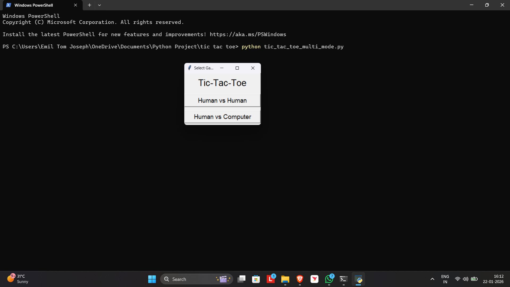
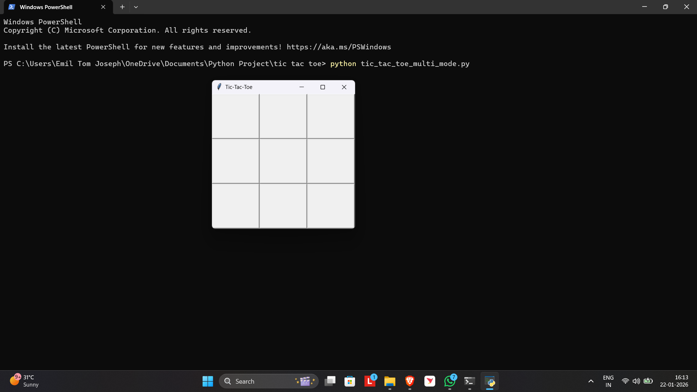
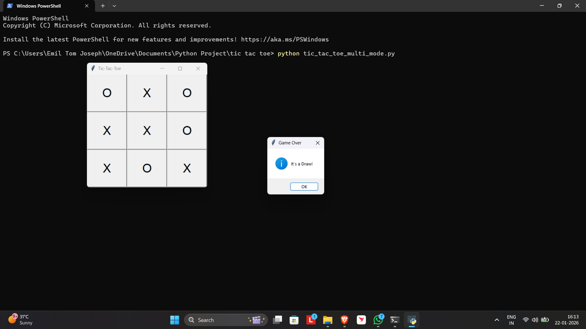
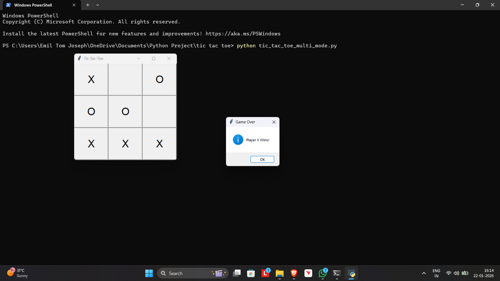

# Tic-Tac-Toe MultiMode (Python GUI)

A graphical Tic-Tac-Toe game developed using **Python and Tkinter** that allows players to choose between **Human vs Human** and **Human vs Computer** gameplay modes.

This project demonstrates GUI programming, event-driven logic, and basic artificial intelligence techniques.

---

## Features

- Interactive **GUI using Tkinter**
- Two gameplay modes:
  - Human vs Human
  - Human vs Computer (AI)
- Automatic **win detection**
- **Draw detection**
- Popup message displaying game results
- Board automatically resets after each round
- Simple AI that:
  - Attempts to win
  - Blocks opponent moves
  - Chooses strategic positions

---

## Technologies Used

- **Python**
- **Tkinter (GUI Library)**
- Event-driven programming
- Rule-based AI logic

---

## Project Structure
tic-tac-toe-multimode
│
├── tic_tac_toe_multi_mode.py
├── screenshots
│ ├── menu.png
│ ├── gameplay.png
│ ├── draw.png
│ └── win.png
└── README.md

---

## Game Modes

### Human vs Human
Two players take turns placing **X** and **O** on the board.

### Human vs Computer
The computer opponent uses rule-based AI logic to:
- Attempt to win
- Block the player’s winning move
- Take the center if available
- Choose a random available position

---

## Screenshots

---

## Future Improvements

- Implement **Minimax AI algorithm**
- Add **difficulty levels**
- Add **scoreboard / match history**
- Improve UI design
- Add animations and sound effects

---

## Author

**Emil Tom Joseph**
B.Tech Computer Science & Engineering (Cyber Security) | Amal Jyothi College of Engineering

---

## License
This project is developed for educational purposes.
